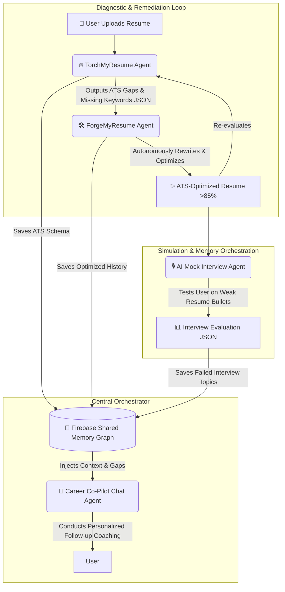

# Nexora
### Autonomous Multi-Agent Career Orchestration Platform

[](https://opensource.org/licenses/MIT)
[](https://test-disha--disha-darshak.asia-southeast1.hosted.app/)
[](https://test-disha--disha-darshak.asia-southeast1.hosted.app/)
[](https://nodejs.org/)
[](https://nextjs.org/)

**Nexora** is an autonomous, multi-agent AI career co-pilot built on Next.js 14, Google's Genkit, and Gemini 1.5 Pro. Unlike traditional platforms that treat AI tools as isolated chatbots, Nexora implements an **interconnected agentic workflow**. Agents share structured state, pass context across a unified user memory graph, and execute closed-loop self-correction pipelines to autonomously optimize resumes, simulate interviews, and guide career roadmaps.


---

## 📍 Table of Contents

- [The Agentic Paradigm](#-the-agentic-paradigm-why-traditional-career-ai-fails)
- [Multi-Agent Architecture & Workflows](#-multi-agent-architecture--workflows)
- [Core Autonomous Agents](#-core-autonomous-agents)
- [✨ Key Features](#-key-features)
- [Live Demo](#-live-demo)
- [Technology Stack](#-technology-stack)
- [🧠 Genkit Multi-Agent Orchestration](#-genkit-multi-agent-orchestration)
- [Getting Started](#-getting-started)
  - [Prerequisites](#prerequisites)
  - [Local Setup](#local-setup)
- [Project Structure](#-project-structure)
- [Future Roadmap](#-future-roadmap)
- [Contributing](#-contributing)
- [License](#-license)

---

## 🧩 The Agentic Paradigm: Why Traditional Career AI Fails

Most AI career platforms operate as stateless, disconnected wrappers around LLMs. A user checks their resume in one tab, practices an interview in another, and asks a chatbot questions in a third — with zero memory or context shared between them.

**Nexora solves this through Shared Agentic Memory and Autonomous Pipelines:**
- **Closed-Loop Optimization:** Diagnostics from one agent autonomously trigger remediation by another (e.g., resume gaps automatically trigger resume rewrites).
- **Stateful Memory Graph:** Interview failures, ATS weaknesses, and skill gaps are persisted to Firebase and injected into the system prompts of downstream agents.
- **Deterministic Agent Handoffs:** Agents communicate via strict, Zod-validated JSON schemas, preventing context bleed and hallucination across multi-step DAGs.

---

## 🤖 Multi-Agent Architecture & Workflows

Nexora orchestrates specialized Genkit agents that communicate through a centralized Firebase User Context Graph.



### Key Agentic Workflows

#### 1. The Autonomous ATS Optimization Loop (`TorchMyResume` ➡️ `ForgeMyResume`)
Instead of just telling the user what is wrong, Nexora executes a closed-loop diagnostic-to-remediation pipeline:
1. **Diagnostic Agent (`TorchMyResume`):** Analyzes the uploaded resume against a target job description. It outputs a strictly typed Zod schema containing `ats_score`, `missing_keywords`, and `weak_bullet_points`.
2. **Remediation Agent (`ForgeMyResume`):** Automatically ingests the JSON payload from `TorchMyResume`. It rewrites the weak bullet points using the STAR (Situation, Task, Action, Result) method, injects the missing domain keywords natively, and re-renders an optimized resume designed to score **>85% on standard ATS parsers**.

#### 2. Cross-Agent Conversational Coaching (`Mock Interview` + `TorchMyResume` ➡️ `AI Chat`)
Nexora's chatbot is not a generic LLM; it is a context-aware **Orchestrator Agent**:
- When a user finishes an **AI Mock Interview**, the Simulation Agent outputs a performance JSON highlighting areas of failure (e.g., *"Struggled with system design scalability questions"*).
- When the user opens the **AI Career Co-Pilot Chat**, the Orchestrator pulls the latest state from both `TorchMyResume` (missing skills) and the `Mock Interview` (communication/technical gaps).
- **The Result:** The Chat Agent immediately opens the conversation proactively, connecting the dots between an interview weak spot and a resume keyword gap, and offering a targeted follow-up exercise to fix both at once.

---

## ✨ Core Autonomous Agents

- **🔥 TorchMyResume (Diagnostic Agent):**
  - Uses Gemini 1.5 Pro multimodal document processing to parse PDFs.
  - Enforces a deterministic JSON schema to output an ATS Match Score, Keyword Density Analysis, and actionable structural critiques.

- **🛠️ ForgeMyResume (Remediation Agent):**
  - Takes the diagnostic schema from `TorchMyResume` as an input prompt.
  - Autonomously refactors bullet points, enhances action verbs, and aligns formatting with target industry standards.

- **🎙️ AI Mock Interview (Simulation Agent):**
  - A stateful, multi-turn voice-enabled interview agent powered by Gemini Generative AI TTS.
  - Dynamically adapts its questioning strategy based on the candidate's real-time answers and the weaknesses flagged in their active resume.

- **💬 AI Career Advisor Chat (Orchestrator Agent):**
  - Acts as the central router. Has read-access to the user's entire assessment history, interview scores, and roadmap progress.
  - Provides continuous, context-aware coaching without requiring the user to re-explain their background.

- **📝 AI Skill-set & Career Path Finder:**
  - A multi-step reasoning agent that maps user skills against real-time market demands (via Adzuna API) to generate personalized, multi-month career roadmaps.

---

## ✨ Key Features

| Feature | What it does |
|---|---|
| 📝 **AI Skill-set Finder** | A multi-step assessment that analyzes a user's skills and interests to recommend the top 3 career paths, then generates a detailed, personalized roadmap (skills to develop, learning resources, project ideas) for the chosen role. |
| 🔥 **TorchMyResume — Rank & Roast** | **Rank:** Upload a resume and get an instant, AI-generated score on its effectiveness for a specific job role, with strengths, weaknesses, and missing keywords. **Roast:** Get brutally honest, humorous, and surprisingly insightful feedback to make your resume unforgettable. |
| 🤖 **AI Mock Interview** | A realistic, voice-enabled interview simulation tailored to a specific job role and difficulty level. Delivers a post-session evaluation including a soft-skill score and detailed feedback. |
| 💬 **AI Career Advisor Chat** | A context-aware chatbot with a ✨ **Personalized Mode** that, with a single click, pulls the user's complete profile, skills, and past evaluation results for deeply holistic, tailored guidance. |
| 📊 **Live Job Market Explorer** | An interactive dashboard backed by a real data pipeline: a Google Apps Script fetches data daily from the Adzuna API into Google Sheets, visualized via an embedded Looker Studio dashboard (top job categories, salary distributions, geographic hotspots, top hiring companies). |
| 📰 **Trending Career News** | A homepage widget pulling the latest career, job-market, and hiring articles from the GNews API. |
| 👥 **Community Platform** | A social space for users to create posts, share professional insights, follow peers, and build a supportive network. |
| 🎙️ **Disha Talks** | A curated content hub of inspirational articles and mock podcasts — success stories, expert interviews — on career growth and industry trends. |
| 👤 **Comprehensive User Profile** | A central dashboard storing personal details, chosen career path, and a full history of assessments, resume reviews, and mock interviews — a persistent record of the user's career journey. |

---

## 🌐 Live Demo

Check out the live, deployed version of the application here:
**[Nexora Live Environment](https://nexora--nexora.us-central1.hosted.app/)**
*(Note: Cloud backend orchestration is optimized for high-concurrency multi-agent workflows.)*

---

## 🛠️ Technology Stack

| Layer | Tools |
|---|---|
| **Frontend** | [Next.js 14](https://nextjs.org/) (App Router), [TypeScript](https://www.typescriptlang.org/), [Tailwind CSS](https://tailwindcss.com/), [Shadcn/UI](https://ui.shadcn.com/), [Framer Motion](https://www.framer.com/motion/) |
| **AI & Orchestration** | [Google Genkit](https://firebase.google.com/docs/genkit), Google Gemini 1.5 Pro / Flash, Zod (schema validation) |
| **Backend & API** | Node.js, Next.js Server Actions / Edge Routes |
| **Database & State Graph** | [Firebase Realtime Database](https://firebase.google.com/docs/database) (persistent agent memory), [Firebase Auth](https://firebase.google.com/docs/auth) |
| **Data Pipeline** | Google Apps Script (daily Adzuna fetch) → Google Sheets → Looker Studio |
| **External APIs** | Adzuna Job Trends API, GNews API |

---

## 🧠 Genkit Multi-Agent Orchestration

All agents are implemented as strongly-typed **Genkit Flows**, guaranteeing type safety from the LLM output down to the Next.js React components.

```typescript
// Example: Interconnected State Hand-off in Genkit
import { generateObject } from 'ai';
import { z } from 'zod';

// 1. Diagnostic Schema from TorchMyResume
const ATSDiagnosticSchema = z.object({
  ats_score: z.number(),
  missing_keywords: z.array(z.string()),
  weak_bullets: z.array(z.string()),
});

// 2. Closed-Loop Remediation Flow (ForgeMyResume)
export async function forgeResumeFlow(resumeText: string, targetJob: string) {
  // Step 1: Run Diagnostic Agent
  const diagnostic = await runTorchMyResume(resumeText, targetJob);

  // Step 2: Pass state into Remediation Agent if score < 85
  if (diagnostic.ats_score < 85) {
    const optimizedResume = await generateObject({
      model: gemini15Pro,
      schema: ResumeSchema,
      prompt: `
        Refactor this resume: ${resumeText}.
        INJECT MISSING KEYWORDS: ${diagnostic.missing_keywords.join(', ')}.
        REWRITE THESE WEAK BULLETS: ${diagnostic.weak_bullets.join('; ')}.
      `,
    });
    return optimizedResume;
  }
  return resumeText;
}
```

---

## 🚀 Getting Started

### Prerequisites
- [Node.js](https://nodejs.org/) (v18 or later) & [Git](https://git-scm.com/)
- A Firebase project with Authentication and Realtime Database enabled.
- A Google Cloud project with Vertex AI / Gemini API access enabled.
- (Optional, for full feature parity) Adzuna API credentials and a GNews API key.

### Local Setup

1. **Clone the repository:**
   ```sh
   git clone https://github.com/thehimanshubansal/Disha-Darshak-AI.git
   cd Disha-Darshak-AI
   ```

2. **Install NPM packages:**
   ```sh
   npm install
   ```

3. **Set up environment variables (`.env.local`):**
   ```env
   # Firebase Configuration
   NEXT_PUBLIC_FIREBASE_API_KEY=your_api_key
   NEXT_PUBLIC_FIREBASE_AUTH_DOMAIN=your_project.firebaseapp.com
   NEXT_PUBLIC_FIREBASE_PROJECT_ID=your_project_id
   NEXT_PUBLIC_FIREBASE_STORAGE_BUCKET=your_project.appspot.com
   NEXT_PUBLIC_FIREBASE_DATABASE_URL=https://your_project-default-rtdb.firebaseio.com

   # External APIs
   ADZUNA_APP_ID=your_id
   ADZUNA_APP_KEY=your_key
   GNEWS_API_KEY=your_gnews_key

   # Google Cloud / Genkit
   GOOGLE_CLOUD_PROJECT_ID=your_gcp_project
   GOOGLE_GENAI_API_KEY=your_gemini_key
   ```

4. **Run the development server:**
   ```sh
   npm run dev
   ```
   Open [http://localhost:3000](http://localhost:3000) to view the multi-agent ecosystem in action.

5. **Useful scripts:**
   ```sh
   npm run dev      # Start local dev server
   npm run build    # Production build
   npm run start    # Serve the production build
   npm run lint     # Lint the codebase
   ```

---

## 📂 Project Structure

```
Disha-Darshak-AI/
├── src/
│   ├── ai/
│   │   ├── flows/          # Genkit Agent Workflows (torch-resume, forge-resume, mock-interview)
│   │   ├── schemas/        # Zod Schemas for deterministic agent-to-agent communication
│   │   └── prompts/        # Context-aware system prompts
│   ├── app/                # Next.js 14 App Router & API Edge Routes
│   ├── components/
│   │   ├── career-compass/ # UI components mapped to respective agents
│   │   └── ui/              # Shadcn Design System
│   ├── contexts/           # Global Client State & Firebase User Graph Provider
│   ├── lib/                # Utility classes, DB connectors, Genkit config
│   └── types/               # Unified TypeScript definitions for agent state
└── docs/                   # System Architecture & API Blueprint
```

---

## 🗺️ Future Roadmap

- [ ] **Autonomous Job Application Agent:** Enable agents to match the optimized `ForgeMyResume` output directly to Adzuna job postings and generate tailored cover letters autonomously.
- [ ] **Multi-Agent Debate:** Implement a system where a "Recruiter Agent" and an "Engineering Manager Agent" debate the candidate's mock interview responses to provide more nuanced feedback.
- [ ] **Advanced Firebase Memory Graph:** Expand the Firebase Realtime Database schema to index long-term conversational state, allowing the Chat Agent to instantly recall historical interview context across months of user interactions without needing complex vector embeddings.
---

## 🤝 Contributing

Contributions are welcome!

1. Fork the repository.
2. Create a feature branch: `git checkout -b feature/your-feature-name`
3. Commit your changes: `git commit -m "Add: short description of change"`
4. Push to the branch: `git push origin feature/your-feature-name`
5. Open a Pull Request describing the change and, if relevant, which agent/flow it touches.

Please keep agent-to-agent contracts (Zod schemas in `src/ai/schemas/`) backward-compatible where possible, since downstream flows depend on them.

---

## 📜 License

Distributed under the MIT License. See `LICENSE` for more information.
